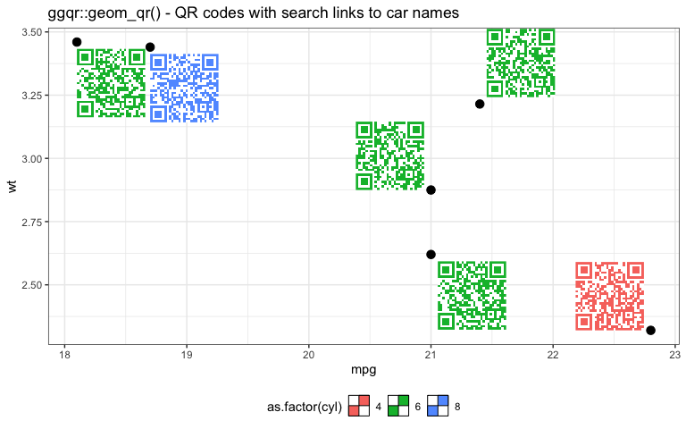

<!-- README.md is generated from README.Rmd. Please edit that file -->

# ggqr

<!-- badges: start -->


<!-- badges: end -->

`ggqr` provides `geom_qr()` for inserting [QR
Codes](https://en.wikipedia.org/wiki/QR_code) into a plot.

The core QR functionality is provided by [Bob
Rudis’s](https://twitter.com/hrbrmstr)
[qrencoder](https://cran.r-project.org/package=qrencoder) package.

### What’s in the box

-   `geom_qr()` to add QR codes to a plot
-   `grGrob()` to create a QR grob

### Future Possibilities?

-   Add automatic label positioning to avoid overlap of codes

## Installation

You can install from [GitHub](https://github.com/coolbutuseless/ggqr)
with:

``` r
# install.package('remotes')
remotes::install_github('coolbutuseless/ggqr')
```

## Example

``` r
library(ggplot2)
library(ggqr)

plot_df       <- head(mtcars)
plot_df$car   <- paste0("https://duckduckgo.com/?q=", rownames(plot_df))
plot_df$hjust <- c(-0.1, 1.1, 1.1, -0.1,   0,   0)
plot_df$vjust <- c( 1.1, 0.0, 0.0, -0.1, 1.1, 1.1)

ggplot(plot_df) +
  geom_qr(
    aes(
      x     = mpg, 
      y     = wt, 
      label = car, 
      hjust = I(hjust), 
      vjust = I(vjust), 
      col   = as.factor(cyl)
    ), 
    size = 0.8
  ) +
  geom_point(aes(mpg, wt), size = 3) +
  theme_bw() + 
  theme(legend.position = 'bottom') +
  labs(title = "ggqr::geom_qr() - QR codes with search links to car names")
```



## Related Software

-   [ggplot2](https://cran.r-project.org/package=ggplot2)
-   [qrencoder](https://cran.r-project.org/package=qrencoder)

## Acknowledgements

-   R Core for developing and maintaining the language.
-   CRAN maintainers, for patiently shepherding packages onto CRAN and
    maintaining the repository
